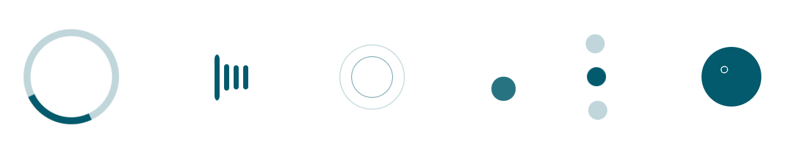

# @codehat/react-loader

> CSS Loader component for `React` which includes 7 loaders. The CSS works were adapted from CodePen artists

[](https://www.npmjs.com/package/@codehat/react-loader) [](https://standardjs.com)


## Install

```bash
npm install --save @codehat/react-loader
```

## Usage

```jsx
import React, { Component } from 'react'

import ReactLoader from '@codehat/react-loader'
import '@codehat/react-loader/dist/index.css'

class Example extends Component {
  render() {
    return <ReactLoader type='Wave' />
  }
}
```

## Props

Using the `type prop` you can activate the following loaders.

- Circles
- BouncingBar
- Wave
- Dots
- TwinCircles
- SpinnerDots
- Focus

## License

MIT © [manojap](https://github.com/manojap)
